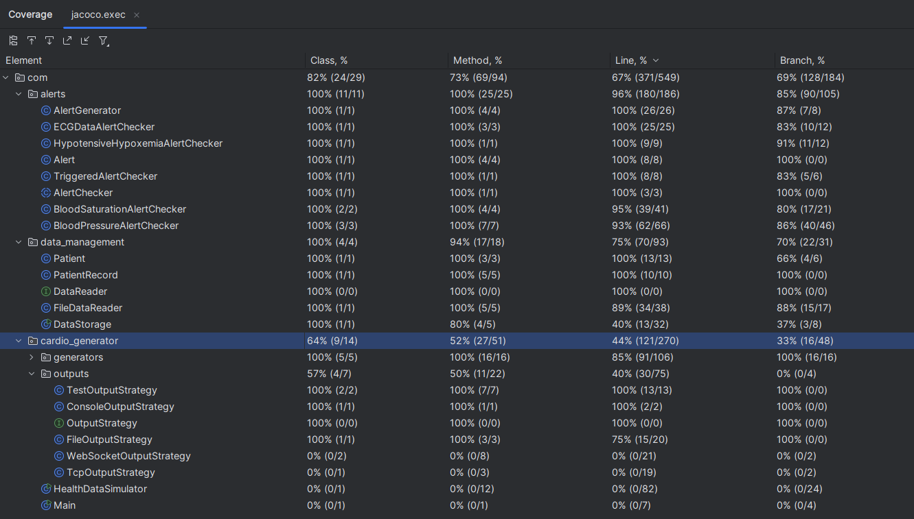

# Code Coverage Report

## Parts not covered in the test (as of finishing part 3)

* `WebSocketOutputStrategy`  - not finished
* `TcpOutputStrategy`  - not finished
* `Main` - simplicity of the code does not call for tests.
* `HealthDataSimulator` - code integrates all others parts 
of the code, which should rather be tested during integration tests,
not unit tests.
