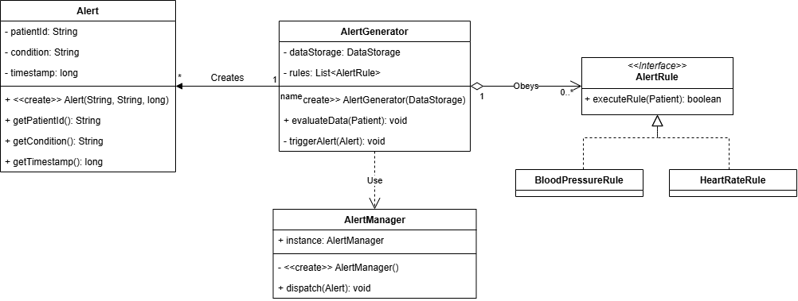
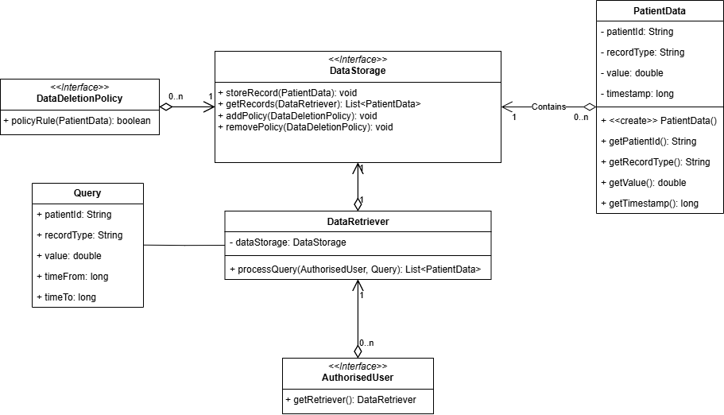
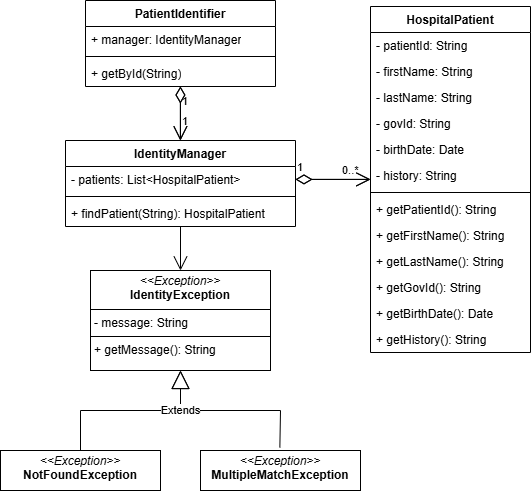
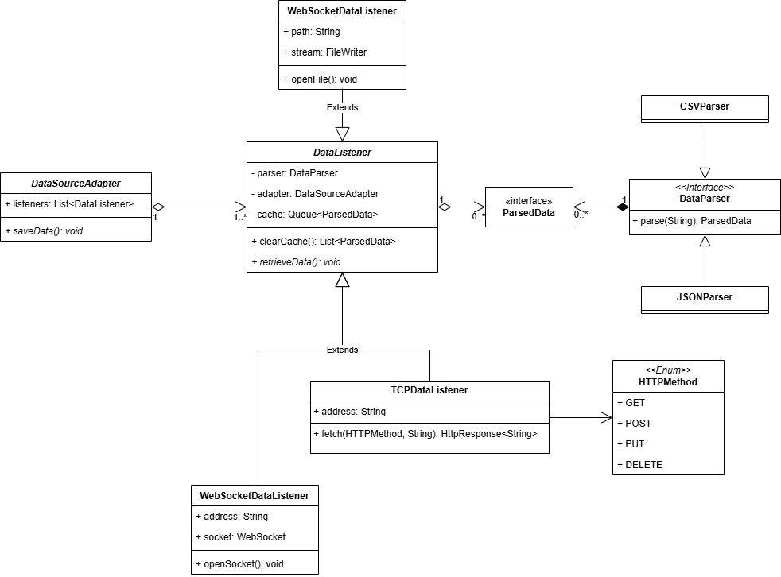

# Explanation for the models of the systems

## Alert Generation System

1. `AlertGenerator` has a direct access to the data storage for easier manipulation and uses its methods.

2. `Alert` servers a role of a record, it does not change after creation so nobody does change one of its values _accidentaly_.

3. `AlertRule`-s are interfaces with separate implementations, therefore they can be easily executed during runtime of the `AlertGenerator`.

4. `AlertManager` is a singleton class, and can be accessed globally. Every alert goes through it to be dispatched.

## Data Storage System

Since `DataStorage` can have different implementations (e.g. in a file, a SQL database, online cloud service, etc.) it became an interface with an appropriate implementaion.

1. There's only 1 `DataRetriever` per `DataStorage` and vice versa.

2. Policies are created in the same way as alert rules in the Alert Generation System.

3. Queries can be created from anywhere in the code. Then they are processed by `DataRetriever`.

4. `DataRetriever` decides, which `AuthorisedUser` implementation has access to certain data records.

## Patient Identification System

`PatientIdentifier` is a class retrieves ID from a generator stream, and passes it to the `IdentityManager`, which then tries to find the record.

1. In case there is no patient found, the `NotFoundException` is raised

2. In case there is an ambiguous match, the `MultipleMatchException` is raised.

3. `Hospital Patient` holds data of an patient: his internal ID, name, Government issued ID (e.g. BSN), birth date and history description.

## Data Access System

`DataListener` is a class that manages the input stream from a file or through network. On each stream input, the data is passed to the parser, then the parsed data is added to the `cache` queue.

`DataSourceAdapter` has a method that gets cached data from all of the listeners and adds it to the storage.

`TCPDataListener` uses HTTP Client to fetch data from a server. Depending on the URL, one can pass an appropriate `HTTPMethod` argument to use GET, POST, etc.
